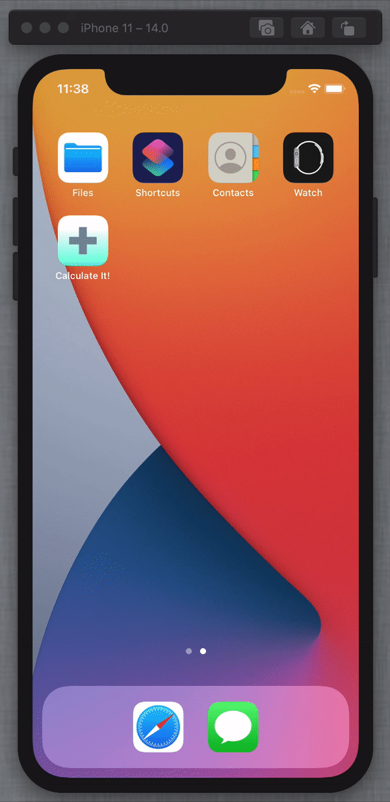

# calculate-it
A calculator that only adds and gives you encouragement when you add correctly.

This project was originially created for an iOS course. The goal of this assignment was to learn how to manipulate variables in swift, use a basic view and the process of creating a basic swift application.

Here is what the app looks like:

