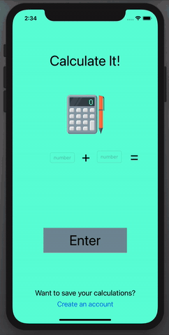

# calculate-it
A calculator that only adds and gives you encouragement when you add correctly.

This project was originally created for an iOS development course as an assignment. The goal of this assignment was to learn how to manipulate variables in swift, use a basic view and the process of creating a basic swift application. The app also has basic error handling to check if there are numbers being added or if they are strings.

Here is a 25 second gif of what the app looks like!

 